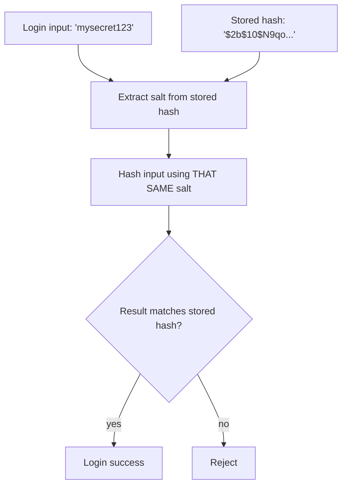
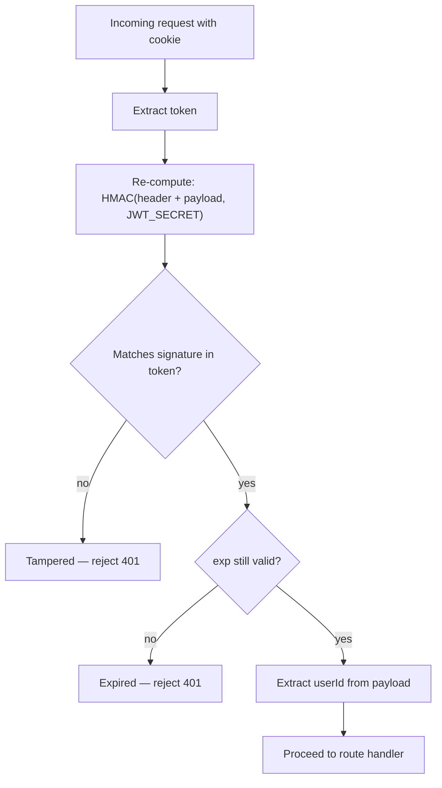
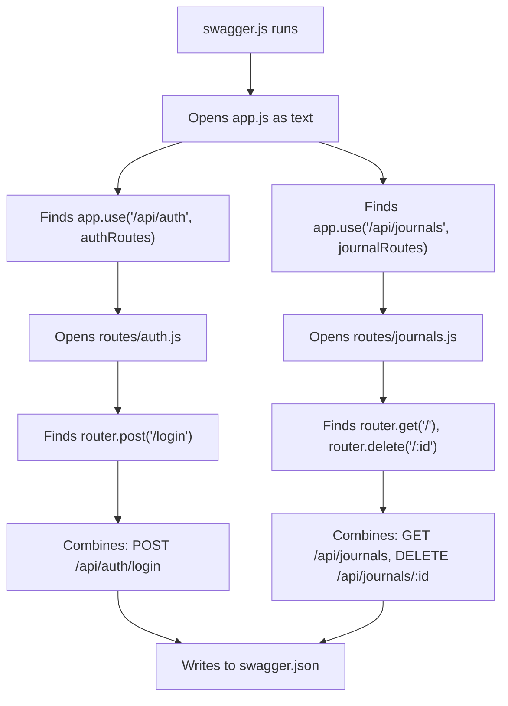
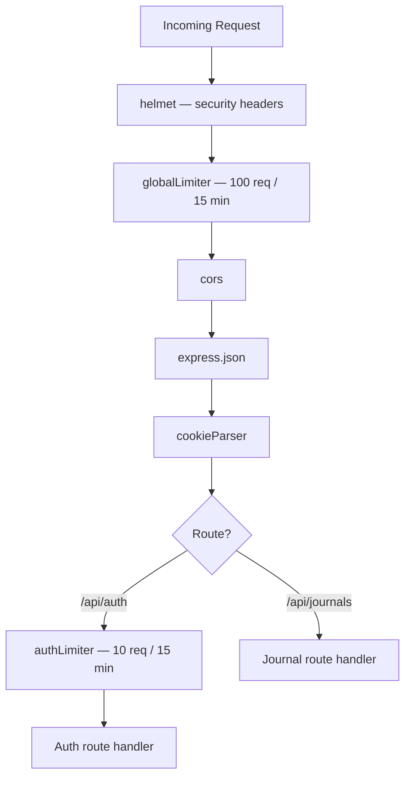
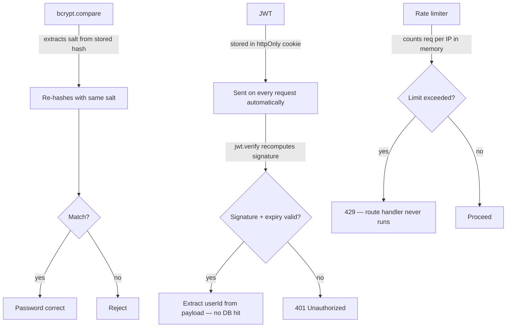

# Node.js Backend Notes - 2026-06-08

Today I went deeper into concepts already implemented — understanding the *why* behind bcrypt, JWT, Swagger, and rate limiting rather than just the *how*.

Covered: bcrypt salt mechanics, JWT self-verification internals, how swagger-autogen crawls routes, and rate limiting deep dive including in-memory vs Redis stores.

---

## bcrypt.compare — How the Same Hash is Reproduced

A common confusion: if bcrypt produces a different hash each time (due to a random salt), how does `bcrypt.compare` ever match?

The answer is that the salt is **embedded inside the stored hash string**.

```txt
$2b$10$N9qo8uLOickgx2ZMRZoMyeIjZAgcfl7p92ldGxad68LJZdL17lh2y

 $2b  → algorithm version
 $10  → saltRounds
 N9qo8uLOickgx2ZMRZoMye  → the SALT (stored here)
 IjZAgcfl7p92ldGxad68LJZdL17lh2y  → the actual hash
```

During `bcrypt.compare`, the salt is extracted from the stored hash and reused:



This is why calling `bcrypt.hash()` manually and comparing outputs never works — it generates a **new random salt** every time:

```js
bcrypt.hash("mysecret123", 10)     // new salt each call → different result every time ❌
bcrypt.compare("mysecret123", storedHash)  // reuses embedded salt → deterministic ✅
```

The database is **never written to** during login. `bcrypt.compare` is purely a read + in-memory computation.

---

## JWT — Storage, Verification, and Expiry

### Where the token lives

JWT is not stored in the database. It lives on the **client**, inside an httpOnly cookie.

```txt
Login → backend calls jwt.sign() → Set-Cookie: jwt=<token> (httpOnly)
Browser stores it automatically
Every request → browser sends cookie automatically
```

`httpOnly` means JavaScript in the browser cannot read or steal it. It is only transmitted by the browser on requests.

### How verification works without a database

JWT is **self-contained**. The token itself carries everything needed to verify it:

```txt
JWT structure:  header.payload.signature

header:   { alg: "HS256" }
payload:  { userId: 42, exp: 1234567890 }
signature: HMAC_SHA256(header + payload, JWT_SECRET)
```

On every request, `jwt.verify()` does:



No database involved in this process. The `JWT_SECRET` on the server is the only source of trust.

### Why tampering does not work

If an attacker modifies the payload (e.g. changes `userId: 42` to `userId: 1`):

```txt
Modified payload → different base64 string
HMAC recomputed  → different expected signature
Stored signature → still the original one
Mismatch         → rejected immediately ❌
```

They cannot forge a valid signature without `JWT_SECRET`.

### Token expiry flow

```txt
Day 1–7:  jwt.verify() → valid ✅ → proceed
Day 8:    jwt.verify() → throws TokenExpiredError ❌ → 401
          Frontend detects 401 → redirects to /login
          User logs in again → new token issued → 7 more days
```

For apps where re-login is unacceptable, a **refresh token** pattern exists — a long-lived token (30 days) stored in DB, used silently to issue new short-lived access tokens (15 min). Not needed for a personal journal app.

---

## How swagger-autogen Crawls Endpoints

The generator config points to `app.js` as the entry point:

```js
const endpointsFiles = ['../app.js']
```

It uses **static analysis** — reads the file as text, does not execute it. The process:



Adding a new route requires only two steps:

```txt
1. Register in app.js: app.use('/api/something', someRoutes)
2. Run: npm run swagger
```

Swagger docs are updated. No annotations required for basic detection.

---

## Rate Limiting

### Why it is necessary

Without rate limiting, an attacker can send unlimited login attempts:

```txt
POST /api/auth/login  × 10,000 requests
→ brute force passwords
→ or crash the server (DoS)
```

Rate limiting caps requests per IP per time window.

### Implementation

Two limiters are used — one global, one strict for auth:

```js
// Global — all routes: 100 requests per 15 minutes per IP
const globalLimiter = rateLimit({
  windowMs: 15 * 60 * 1000,
  max: 100,
  standardHeaders: true,
  legacyHeaders: false,
  message: { error: 'Too many requests, please try again later.' }
})

// Auth — login/signup only: 10 attempts per 15 minutes per IP
const authLimiter = rateLimit({
  windowMs: 15 * 60 * 1000,
  max: 10,
  standardHeaders: true,
  legacyHeaders: false,
  message: { error: 'Too many login attempts, please try again in 15 minutes.' }
})
```

Middleware order in `app.js`:



`standardHeaders: true` sends these headers back to the client:

```txt
RateLimit-Limit: 10
RateLimit-Remaining: 7
RateLimit-Reset: <timestamp>
```

### How IP tracking works — the proxy problem

By default, the limiter uses `req.ip`. But behind a proxy (nginx, Cloudflare), `req.ip` always shows the proxy's IP — not the real user's.

Fix required before production:

```js
app.set('trust proxy', 1)
// Now req.ip correctly reads X-Forwarded-For header
```

Without this, all users share one rate limit bucket. Not relevant for localhost dev.

### Where counts are stored

By default: **in-memory** (a plain JS object inside the process).

```txt
Problem 1: Server restarts → counts reset
Problem 2: Multiple instances → each has its own counter
           Attacker: 10 req to instance A + 10 req to instance B = 20 total, undetected
```

For multi-instance production setups, use a **Redis store**:

```js
const RedisStore = require('rate-limit-redis')

rateLimit({
  store: new RedisStore({ client: redisClient }),
  ...
})
```

All instances share one counter. For a single-instance personal app, in-memory is fine.

### Other options worth knowing

Skipping the limiter for trusted clients:

```js
rateLimit({
  skip: (req) => req.ip === '127.0.0.1'
})
```

Different limits for authenticated vs anonymous users:

```js
rateLimit({
  keyGenerator: (req) => req.userId ?? req.ip
})
```

---

## Main Takeaway



```txt
What I understand now:
  - bcrypt.compare reuses the embedded salt — same input always produces same output
  - JWT is self-verifying via HMAC signature — no DB lookup needed per request
  - Rate limiting is a gatekeeper — rejects at middleware layer before any real work runs
  - In-memory store is fine for single instance; Redis needed when scaling horizontally
  - trust proxy must be set before going to production behind a reverse proxy
```
