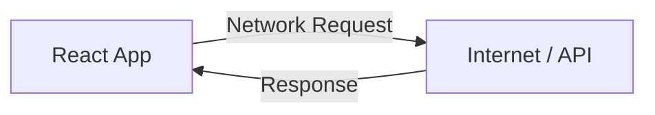
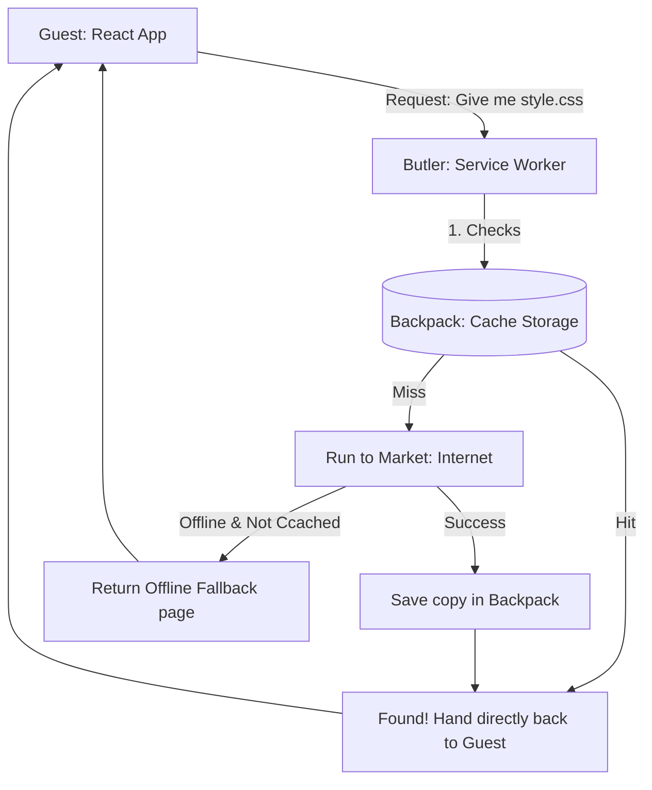
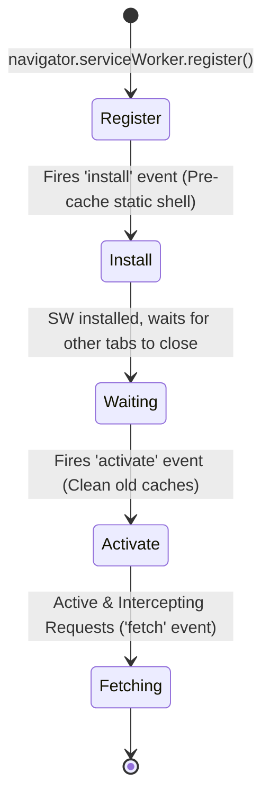

# PWA and Service Worker Basics - 2026-06-09

Today I focused on Progressive Web Apps (PWAs) — understanding how they differ from native apps, configuring the Web App Manifest with Richer Install UI assets, and learning the Service Worker lifecycle using a butler analogy.

Covered: PWA fundamentals, `manifest.json` configurations, icon sizing requirements, screenshots, and the Service Worker lifecycle stages.

---

## 1. PWA Fundamentals

A **Progressive Web App (PWA)** is a website built with web technologies that behaves like a native application. 

### PWA vs. Native Apps

| Feature | Native App | PWA |
| :--- | :--- | :--- |
| **Distribution** | App Stores (Google Play / App Store) | Web URL / Browser prompt |
| **Install Size** | Large (typically 50MB+) | Small (typically < 1MB) |
| **Updates** | App Store update triggers | Auto-updates when page refreshes |
| **Offline Support** | Built-in | Programmed via Service Worker |
| **Core Dev Stack** | Swift, Kotlin, Java, React Native | HTML, CSS, JavaScript |

---

## 2. Web App Manifest (`manifest.json`)

The Web App Manifest is a JSON file that provides the browser with metadata about how your application should behave when installed on a device.

Key fields configured today:
* `name` & `short_name`: The full name and the name displayed under the home screen icon.
* `display`: Set to `standalone` to remove the browser UI and address bar.
* `theme_color`: Sets the styling of the OS system bar when the app is active.
* `background_color`: Styling for the splash screen when launching.
* `icons`: Requires exactly `192x192` and `512x512` images.
* `screenshots`: Essential for Chrome's **Richer Install UI**. Needs at least:
  * One wide screenshot (e.g., `1280x720` with `form_factor: "wide"`)
  * One narrow screenshot (e.g., `390x844` with `form_factor: "narrow"` or not set)

---

## 3. The Service Worker: "The Butler" Analogy

A Service Worker is a client-side programmable network proxy. It acts as an intermediary layer between your React app and the network.

### Traditional Request Model (No Butler)

Without a Service Worker, your app has to talk directly to the network. If the connection fails, the user gets a "No Internet" screen.



### PWA Request Model (The Butler at the Door)

A Service Worker acts like a **Butler** standing by the room door. The **Guest** (React App) asks the Butler for items, and the Butler decides how to retrieve them.



Because the Service Worker runs in a separate thread, it operates in the background even if the React page itself is closed.

---

## 4. Service Worker Lifecycle

A Service Worker goes through a strict multi-stage lifecycle to ensure updates do not break active sessions.



### 1. Registration (Hiring the Butler)
Initiated in the main application code (e.g. `src/main.jsx`). The browser downloads and evaluates the script.
```js
if ('serviceWorker' in navigator) {
  navigator.serviceWorker.register('/sw.js')
    .then(reg => console.log('Service Worker Registered!', reg))
    .catch(err => console.error('Registration failed:', err));
}
```

### 2. Installation (Pre-packing the Backpack)
Fires once when the worker is downloaded for the first time or when it changes. This is the optimal place to open the Cache and store resources.
```js
self.addEventListener('install', (event) => {
  console.log('SW Installed');
  // pre-caching code goes here
});
```

### 3. Activation (Dismissing the Old Butler)
Fires when the service worker is activated and ready to assume control. If an older service worker is running, the new one waits in the background until all tabs running the old version are closed.
```js
self.addEventListener('activate', (event) => {
  console.log('SW Activated');
  // old cache cleanup code goes here
});
```

### 4. Fetch (Running errands)
Once active, every HTTP request the app initiates passes through this listener. The Service Worker can intercept, modify, cache, or bypass the request.
```js
self.addEventListener('fetch', (event) => {
  console.log('Intercepted request for:', event.request.url);
  // caching/routing strategy goes here
});
```

---

## 5. Asset Caching & Cache-First Strategy

To populate the Butler's backpack (cache) and enable offline capabilities, we implemented three key steps in `sw.js` today:

### A. Pre-caching on Install
An array of static path URLs is defined. The `install` event uses `caches.open` and `cache.addAll` to pre-download the app shell.
```js
const CACHE_NAME = 'journal-cache-v1'
const ASSETS_TO_CACHE = [
  '/',
  '/index.html',
  '/manifest.json',
  '/favicon.svg',
  '/icons/icon-192.png',
  '/icons/icon-512.png',
  '/screenshots/screenshot-desktop.png',
  '/screenshots/screenshot-mobile.png'
]

self.addEventListener('install', (event) => {
  event.waitUntil(
    caches.open(CACHE_NAME).then((cache) => {
      return cache.addAll(ASSETS_TO_CACHE)
    })
  )
})
```

### B. Old Cache Cleanup on Activate
When a new Service Worker activates, it reads all existing Cache keys. If any keys do not match the current `CACHE_NAME` (e.g. `journal-cache-v1` vs an old `journal-cache-v0`), it deletes them.
```js
self.addEventListener('activate', (event) => {
  event.waitUntil(
    caches.keys().then((cacheNames) => {
      return Promise.all(
        cacheNames.map((cache) => {
          if (cache !== CACHE_NAME) {
            return caches.delete(cache)
          }
        })
      )
    })
  )
})
```

### C. Cache-First Fetch Strategy
For every `GET` request from the app, the Service Worker intercepts it and checks the Cache. 
* **Cache Hit:** Immediately return the stored response.
* **Cache Miss:** Retrieve the asset from the network.
```js
self.addEventListener('fetch', (event) => {
  if (event.request.method !== 'GET') return

  event.respondWith(
    caches.match(event.request).then((cachedResponse) => {
      return cachedResponse || fetch(event.request)
    })
  )
})
```

### D. Updating Cached Assets (Cache Invalidation)
Because static assets are stored via a **Cache-First** strategy, the browser will not query the network for them unless the cache changes.

To update files (e.g. you edited a JS component, changed CSS, or replaced an icon):
1. **Change the cache version string in `sw.js`:**
   ```javascript
   const CACHE_NAME = 'journal-cache-v2' // Incremented from v1
   ```
2. **Evaluation:** The browser downloads `sw.js`, sees that the file has changed (due to the version change), and downloads it.
3. **Installation:** The new Service Worker installs, creates the new cache namespace (`v2`), and pre-caches the updated assets.
4. **Activation:** Once all old tabs running the app are closed, the new worker activates. Its `activate` handler loops through the browser caches and deletes the obsolete `v1` cache, ensuring the client receives the fresh `v2` files upon next launch.

---

## Main Takeaway

* A PWA is built on two core components: `manifest.json` (metadata for installation/UI appearance) and a Service Worker (a background thread proxy handling network requests and caching).
* Icons must be strictly sized (`192x192` and `512x512`). 
* Chrome's Richer Install UI requires both wide and narrow screenshots.
* The Service Worker is independent of the DOM and cannot directly access `window` or `document`.
* Cache storage acts as a local database for HTTP responses, allowing the app to run completely offline once the static asset shell is cached.
* **Cache-First** strategy is ideal for static assets (HTML, CSS, JS, images) because they change infrequently and speed is prioritized.
* **Cache Invalidation:** To deploy front-end updates when using a Cache-First strategy, you must manually increment the version string in `CACHE_NAME` inside `sw.js`.

